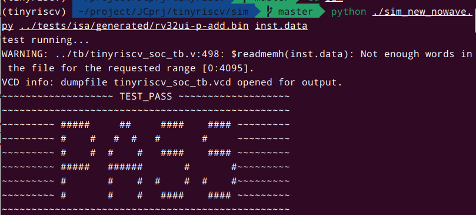
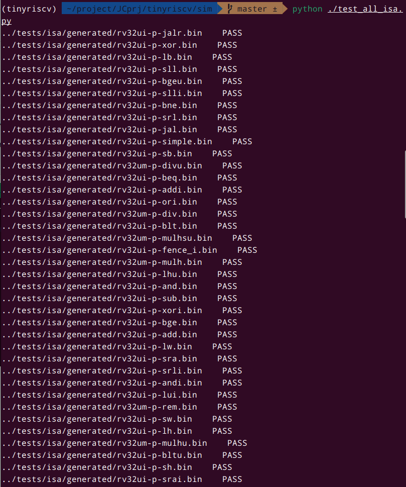
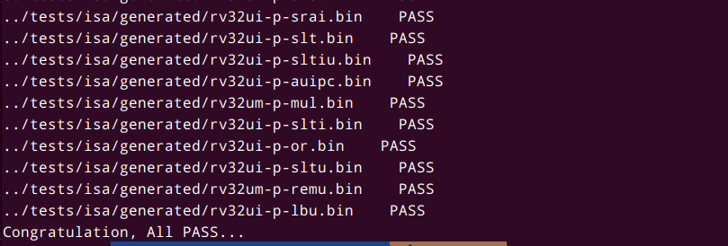
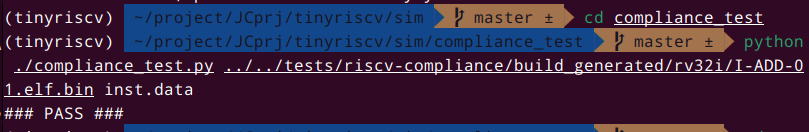
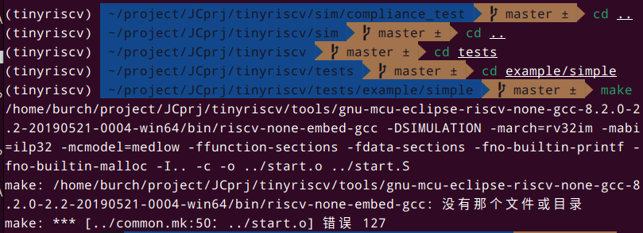
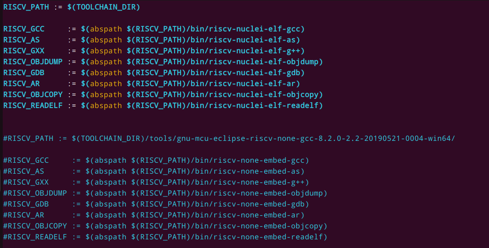
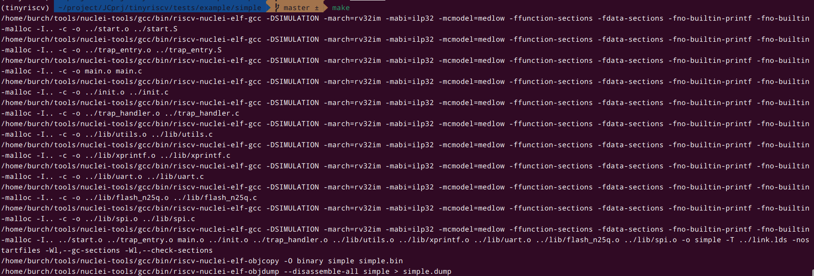
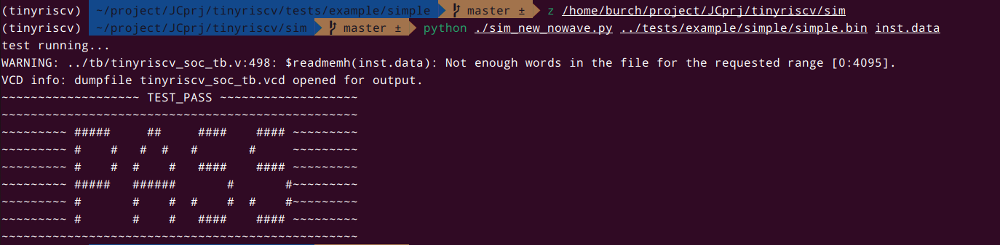

# tinyriscv 测试（使用 Nuclei 官方 gcc 套件）

```bash
git clone git@github.com:liangkangnan/tinyriscv.git
cd tinyriscv/sim
python ./sim_new_nowave.py ../tests/isa/generated/rv32ui-p-add.bin inst.data
```



```bash
python ./test_all_isa.py
```





```bash
cd compliance_test
python ./compliance_test.py ../../tests/riscv-compliance/build_generated/rv32i/I-ADD-01.elf.bin inst.data
```



```bash
#这里由于没有装tinyriscv的gcc套件，所以直接make会报错
make
```



```
#修改Makefile和example文件夹中的common.mk
#把Makefile中TOOLCHAIN_DIR路径改为本地的已经安装过的Nuclei提供的gcc
TOOLCHAIN_DIR = /home/burch/tools/nuclei-tools/gcc/

#common.mk文件修改如下
RISCV_PATH := $(TOOLCHAIN_DIR)

RISCV_GCC     := $(abspath $(RISCV_PATH)/bin/riscv-nuclei-elf-gcc)
RISCV_AS      := $(abspath $(RISCV_PATH)/bin/riscv-nuclei-elf-as)
RISCV_GXX     := $(abspath $(RISCV_PATH)/bin/riscv-nuclei-elf-g++)
RISCV_OBJDUMP := $(abspath $(RISCV_PATH)/bin/riscv-nuclei-elf-objdump)
RISCV_GDB     := $(abspath $(RISCV_PATH)/bin/riscv-nuclei-elf-gdb)
RISCV_AR      := $(abspath $(RISCV_PATH)/bin/riscv-nuclei-elf-ar)
RISCV_OBJCOPY := $(abspath $(RISCV_PATH)/bin/riscv-nuclei-elf-objcopy)
RISCV_READELF := $(abspath $(RISCV_PATH)/bin/riscv-nuclei-elf-readelf)


#修改完之后进入simple目录
make
```





```bash
#zsh的z指令可以直接跳转sim文件夹
z /home/burch/project/JCprj/tinyriscv/sim
python ./sim_new_nowave.py ../tests/example/simple/simple.bin inst.data
```


